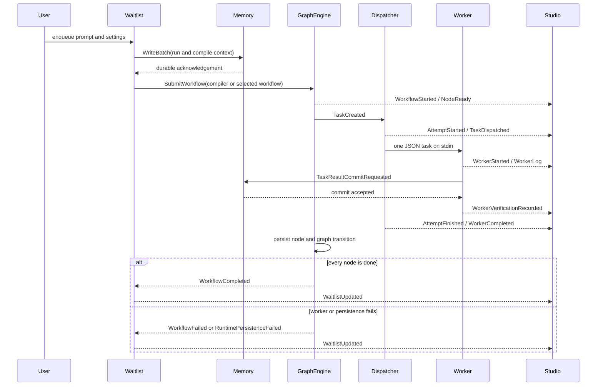

# End-to-end orchestrator sequence

Compilation uses the same worker protocol and lifecycle as a task workflow. Provider selection and bounded retries occur inside the dispatcher. Event names in this diagram are defined by the current event-taxonomy specification.
