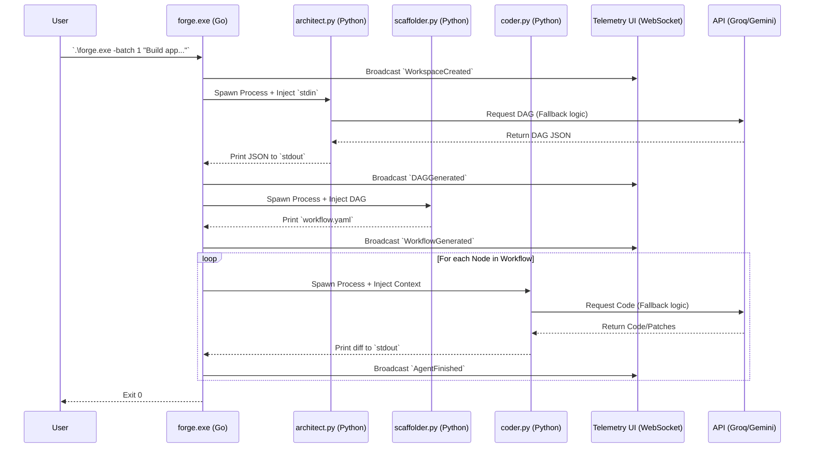

# E2E Orchestrator Sequence Diagram

This diagram outlines the complete flow of a user command through the Go orchestrator, down to the Python agents, and back to the Telemetry UI.

```mermaid
sequenceDiagram
    participant User
    participant ForgeCLI as forge.exe (Go)
    participant Architect as architect.py (Python)
    participant Scaffolder as scaffolder.py (Python)
    participant Coder as coder.py (Python)
    participant Telemetry as Telemetry UI (WebSocket)
    participant LLM as API (Groq/Gemini)

    User->>ForgeCLI: `.\forge.exe -batch 1 "Build app..."`
    ForgeCLI->>Telemetry: Broadcast `WorkspaceCreated`
    
    ForgeCLI->>Architect: Spawn Process + Inject `stdin`
    Architect->>LLM: Request DAG (Fallback logic)
    LLM-->>Architect: Return DAG JSON
    Architect-->>ForgeCLI: Print JSON to `stdout`
    ForgeCLI->>Telemetry: Broadcast `DAGGenerated`

    ForgeCLI->>Scaffolder: Spawn Process + Inject DAG
    Scaffolder-->>ForgeCLI: Print `workflow.yaml`
    ForgeCLI->>Telemetry: Broadcast `WorkflowGenerated`

    loop For each Node in Workflow
        ForgeCLI->>Coder: Spawn Process + Inject Context
        Coder->>LLM: Request Code (Fallback logic)
        LLM-->>Coder: Return Code/Patches
        Coder-->>ForgeCLI: Print diff to `stdout`
        ForgeCLI->>Telemetry: Broadcast `AgentFinished`
    end

    ForgeCLI-->>User: Exit 0
```
