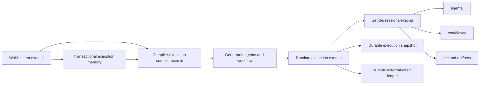

# Session isolation architecture

Each waitlist item owns an isolated session directory. Concurrent sessions do not edit one shared physical `src` tree, and the v1 worker protocol does not support the legacy stdin file-lock message scheme. File tools enforce containment inside the selected session and use exact, guarded mutations. Follow-on work can explicitly inherit checked files from an earlier execution in the same sequential group.

Isolation prevents accidental cross-run writes. It does not merge two completed sessions back into an external project; that requires an explicit review/integration step.
