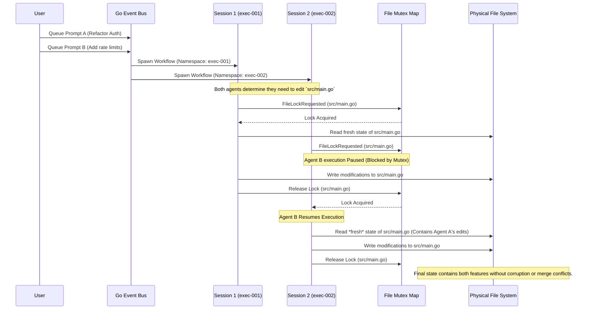

# Session Isolation & Pessimistic File Locking Architecture

This diagram illustrates how `forge.exe` safely manages two completely isolated executing sessions (`exec-001` and `exec-002`) that are both attempting to modify the same shared physical file (`src/main.go`).

