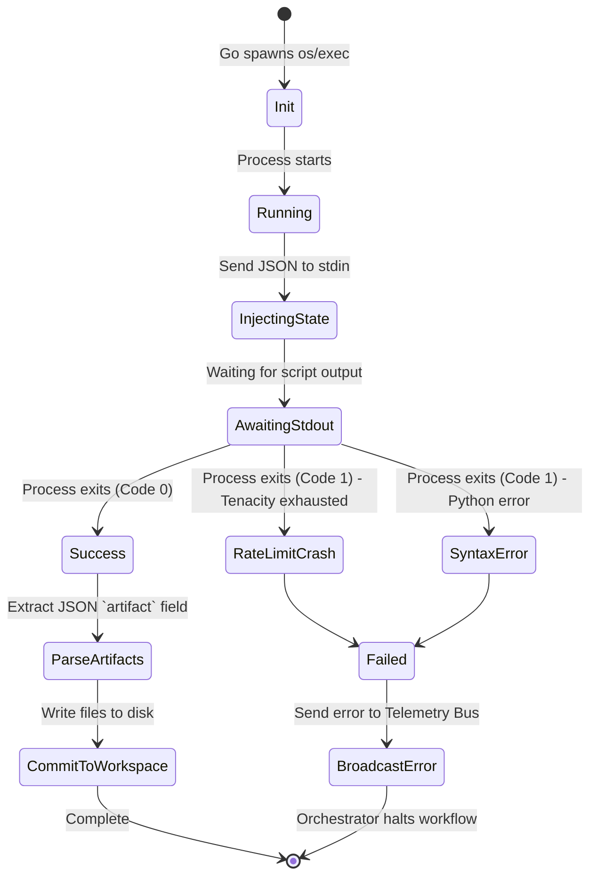

# Sub-process Lifecycle State Machine

This diagram models the strict lifecycle of a Python worker process spawned by `forge.exe` via the `executor.go` layer.

```mermaid
stateDiagram-v2
    [*] --> Init: Go spawns os/exec
    
    Init --> Running: Process starts
    Running --> InjectingState: Send JSON to stdin
    InjectingState --> AwaitingStdout: Waiting for script output
    
    AwaitingStdout --> Success: Process exits (Code 0)
    AwaitingStdout --> RateLimitCrash: Process exits (Code 1) - Tenacity exhausted
    AwaitingStdout --> SyntaxError: Process exits (Code 1) - Python error
    
    RateLimitCrash --> Failed
    SyntaxError --> Failed
    
    Success --> ParseArtifacts: Extract JSON `artifact` field
    ParseArtifacts --> CommitToWorkspace: Write files to disk
    CommitToWorkspace --> [*]: Complete
    
    Failed --> BroadcastError: Send error to Telemetry Bus
    BroadcastError --> [*]: Orchestrator halts workflow
```
