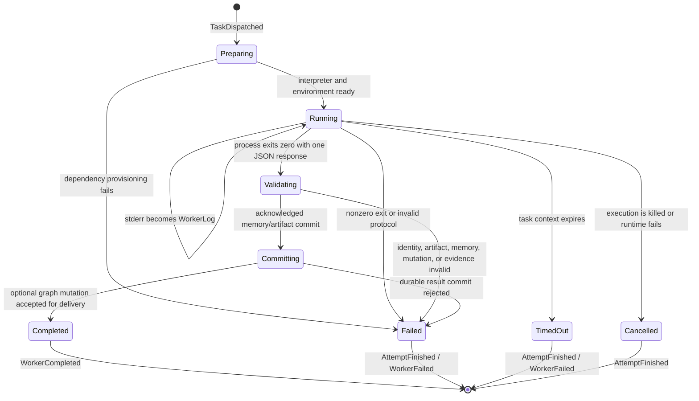

# Worker subprocess lifecycle

The Go `Worker.Execute` implementation owns process creation, bounded stdout/stderr capture, protocol validation, and acknowledged result commit. The dispatcher owns attempt identity and retry policy. Provider libraries do not perform hidden retries. A failed attempt can be retried only when it is classified as transient and the worker proves that no effect started.
