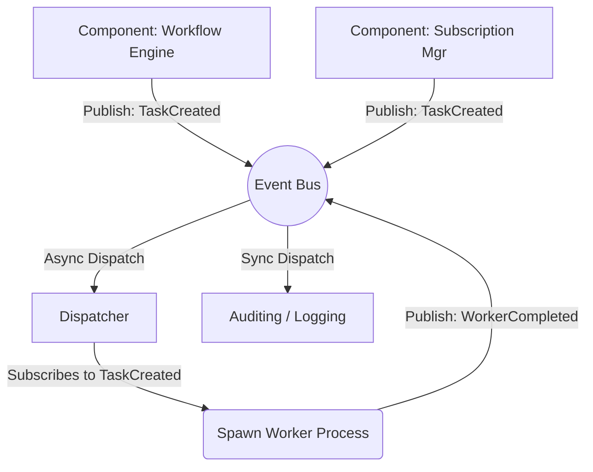
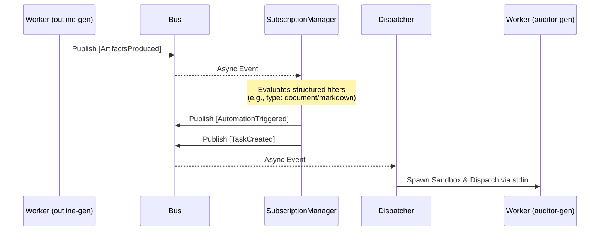

# Orchestrator Architecture (v1)

The HyperParallel Runtime Orchestrator is an event-driven control plane built entirely on an asynchronous publish-subscribe model. It is designed to coordinate thousands of concurrent, highly-isolated Worker processes dynamically.

## 1. Core Philosophy

The Orchestrator follows a **Shared-Nothing, Event-Everything** philosophy. Internal components do not hold direct references to one another. Instead, they communicate exclusively by publishing and subscribing to standardized `RuntimeEvents` over the central `events.Bus`.

This complete decoupling guarantees that adding new subsystems (such as a WebSocket gateway or long-lived daemon managers) requires zero changes to existing orchestration logic.

## 2. Event Bus Routing

The central `events.Bus` provides a high-throughput, asynchronous channel for inter-component communication. 

> [!TIP]
> **Asynchronous Dispatch:** To prevent blocking the core event loop, wildcards (like loggers) are evaluated sequentially to guarantee chronological ordering, but specific event subscriptions (e.g., `Dispatcher` listening for `TaskCreated`) are spun off into a concurrent goroutine pool.

## 3. The Subsystems

The Orchestrator is composed of three primary specialized subsystems:

### A. The Workflow Engine
The Workflow Engine is responsible for executing declarative YAML-based Directed Acyclic Graphs (DAGs). 
- **Graph Evaluation:** It maps parent-child dependencies and resolves topological ordering.
- **Node Dispatch:** It waits for prerequisite artifacts to be generated before emitting a `TaskCreated` event for the next node in the graph.
- **Failure Cascades:** If a Worker crashes and exhausts retries, it emits `TaskFailed`, causing the engine to halt the workflow and emit `WorkflowFailed`.

### B. The Dispatcher
The Dispatcher translates orchestrator intent into physical execution.
- **Process Isolation:** It listens for `TaskCreated` events, spinning up a sandbox/child process (Python, Go, Binary) for the requested agent.
- **Protocol Enforcer:** It serializes the `Task` struct via `stdin` (the **Worker Protocol v1**) and parses structured JSON output from `stdout`.
- **Handoff:** When a worker finishes, the Dispatcher translates the standard output into runtime events (`WorkerCompleted`, `ArtifactsProduced`).

### C. The Subscription Manager (Automations)
The Subscription Manager provides implicit execution outside of rigid DAGs.
- **Declarative Filtering:** It parses `subscriptions` blocks in Agent YAMLs, mapping event types to structured filters.
- **Micro-Orchestration:** When an event matches an agent's filters, it dynamically emits a `TaskCreated` event.

## 4. Execution Origins

A `Task` in HyperParallel can originate from one of two completely distinct paradigms. This is denoted by the `Origin` field in the `Task` payload:

1. `Origin: "workflow"` - The task is a node within a strict execution DAG managed by the Workflow Engine.
2. `Origin: "automation"` - The task was implicitly triggered by an event via the Subscription Manager.
