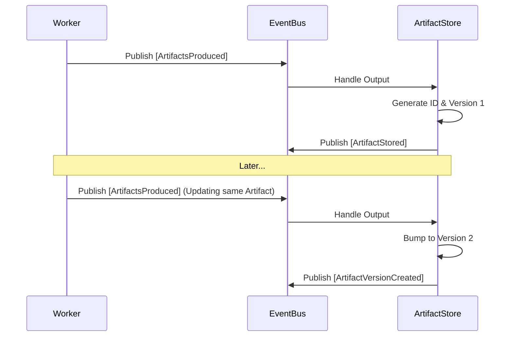
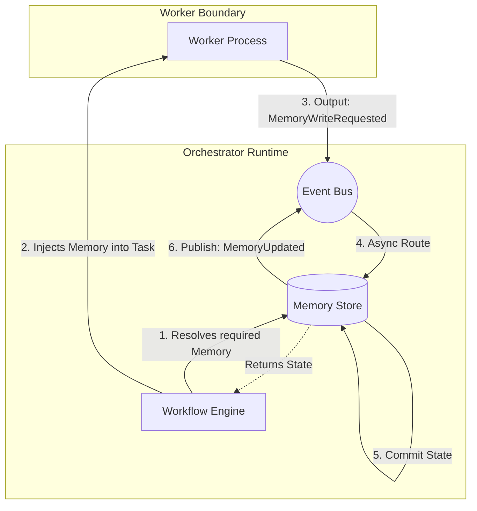

# Runtime Memory & Artifacts (v1)

HyperParallel agents are modeled as pure, deterministic functions (Worker Protocol v1). They do not retain persistent dynamic memory across invocations. To orchestrate state, the runtime provides an externally managed Shared Runtime Memory and an Append-Only Artifact Store.

## 1. Artifact Store

Artifacts represent significant outputs generated by agents, such as documents, compiled binaries, or structured data payloads.

### Append-Only Versioning
The Artifact Store operates under strict immutability rules. Artifacts cannot be mutated or deleted. Updates to an artifact's data trigger a new monotonically increasing `Version`.

### Provenance Tracking
Every artifact retains immutable lineage:
- **`Producer`:** The `agent_id` of the worker that created it.
- **`Parents`:** A list of `artifact_id`s that the worker read in order to produce this new artifact.

> [!TIP]
> **API Guarantees:** Because artifacts are append-only, the orchestrator can safely query historical states using `GetVersion(id, version)`. This allows execution workflows to snapshot state and rollback safely.

## 2. Shared Runtime Memory

While Artifacts represent large, formal data objects, **Shared Runtime Memory** acts as a rapid scratchpad for agents to share scalars, flags, and configuration.

### Scoping Rules
Memory is isolated hierarchically via composite keys (`Scope:ScopeID:Key`):

1. **Global Scope (`global:*`)**
   - Accessible by any agent across any workflow. Useful for system-wide configuration.
2. **Workflow Scope (`workflow:<exec_id>`)**
   - Sandboxed to a specific workflow execution DAG. Data dies when the workflow finishes.
3. **Agent Scope (`agent:<agent_id>`)**
   - Sandboxed to a specific agent type. Can be used for shared agent-specific caches across different workflows.

### Orchestrator-Managed State
To preserve the deterministic purity of Worker Protocol v1, agents **do not** interact directly with the memory store at runtime. 

1. **Memory Reads:** The Workflow Engine intercepts dependencies and proactively queries the Memory Manager. It injects the resolved `MemoryEntry` structures directly into the `Task` JSON sent over `stdin`.
2. **Memory Writes:** Workers output `MemoryWriteRequested` payloads to `stdout`. The Dispatcher forwards this to the Event Bus, where the Memory Manager ingests it and publishes a `MemoryUpdated` confirmation.

By keeping state out of the sandbox, the Orchestrator prepares the system for seamless scaling. A future migration to WebSockets, gRPC, or MCPs requires zero refactoring of agent logic, as agents remain pure deterministic functions over standard inputs.
